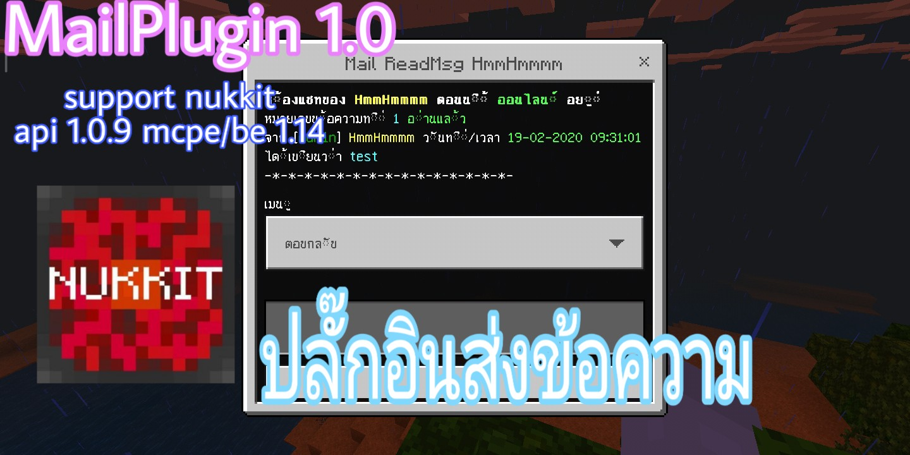

**คุณสมบัติปลั๊กอิน**<br>
- มี gui form
- มี report
- เป็นปลั๊กอินส่งข้อความหาผู้เล่น (สามารถส่งข้อความแบบออฟไลน์ได้)
- สามารถดูข้อความที่เราส่งไปว่า อ่านรึยัง?


**วิธีใช้งาน**<br>
- คลิปตัวอย่าง เวอร์ชั่น 1.0 [คลิก](https://youtu.be/OgWbkfY7foE)


## ดาวโหลด
| version  | plugin support                        | Download  zip/phar                                                 |
| ---- | ------------------------------------ | ---------------------------------------------------------- |
| 1.0  | nukkit api 1.0.9 mcpe 1.14 [Click here](https://github.com/NukkitX/Nukkit) | [คลิก](https://github.com/HmmHmmmm/MailPluginNukkit/releases/1.0) |


**Config**<br>
```
#ชื่อผู้เล่นที่จะรับข้อความ report
report:
  name: HmmHmmmm
```


**Command**<br>
- /mail : เปิด gui form
- /mail info : เครดิตผู้สร้าง
- /mail write <ชื่อผู้เล่น> : แล้วพิมที่แชทเขียนข้อความเพื่อส่งข้อความให้ผู้เล่นคนนั้น
- /mail read <ชื่อผู้ที่ส่งข้อความ> : อ่านข้อความผู้ที่ส่งมา
- /mail read-all : อ่านข้อความผู้ที่ส่งมาทั้งหมด
- /mail clear <ชื่อผู้ที่ส่งข้อความ> <หมายเลขข้อความ> : เพื่อลบข้อความนั้น
- /mail clear-all : เพื่อลบข้อความของผู้ที่ส่งมาทั้งหมด
- /mail see <ชื่อผู้เล่น> : เพื่อดูข้อความที่เราส่งไปว่าเค้าอ่านรึยัง?
- /report : แจ้งแอดมิน


**API**<br>
- ดูเลขข้อความที่มีอยู่ทั้งหมด Mail.getThis().getCountMail(String playerName)


**Install API**<br>

- ก็อปไฟล์ MailPlugin.jar ในลง $HOME/lib/
- จากนั้น ก็อปโค้ดตามล่างล่าง ลงใน pom.xml ของคุณ ของบรรทัด dependencies
- แค่นี้ก็ ติดตั้ง api ได้ละ

```xml
<dependency>
    <groupId>hmmhmmmm.mail</groupId>
    <artifactId>MailPlugin</artifactId>
    <version>1.0</version>
    <optional>false</optional>
    <scope>system</scope>
    <systemPath>${basedir}/lib/MailPlugin.jar</systemPath>
</dependency>
```